# Novaris
### Enterprise Role-Based AI Assistant using Retrieval-Augmented Generation (RAG)


---

## Overview

Novaris is a secure enterprise AI assistant that allows employees to query internal company documents using a Large Language Model while ensuring they only receive information they are authorized to access.

Unlike a traditional chatbot, Novaris performs **authentication**, **role-based authorization**, and **document retrieval** before generating an AI response. Every answer is produced only from documents that belong to the authenticated user's role.

The project demonstrates how modern AI applications can combine secure authentication, Retrieval-Augmented Generation (RAG), and cloud deployment into a single production-ready system.

---

## Why I Built This Project

Many AI chatbots can answer questions, but very few demonstrate how AI systems should operate inside an enterprise environment where document security is critical.

Novaris was built to explore questions such as:

- How can employees securely interact with company documents?
- How can AI respect department-level permissions?
- How can authentication and authorization remain independent?
- How can a complete AI application be deployed securely on the cloud?

The project focuses on solving these problems while following clean software engineering principles and modular architecture.

---

## Key Features

### Authentication & Security

- JWT-based authentication
- Refresh token rotation
- HttpOnly cookie authentication
- Automatic access token refresh
- Absolute session expiry
- Session binding
- Argon2 password hashing
- Progressive account lockout
- Secure logout with session invalidation

---

### Role-Based Access Control (RBAC)

Each employee belongs to exactly one application role.

Supported roles include:

- Finance
- Human Resources
- Engineering
- Marketing
- Employee
- C-Level
- Administrator

Every AI request is authorized before document retrieval begins, ensuring users can only access information permitted for their department.

---

### Retrieval-Augmented Generation (RAG)

Novaris implements a complete Retrieval-Augmented Generation pipeline.

The workflow includes:

- Document ingestion
- Automatic text chunking
- HuggingFace embeddings
- ChromaDB vector storage
- Semantic retrieval using MMR
- Prompt construction
- AI response generation using Groq Qwen 3.6 27B

Only authorized documents participate in retrieval.

---

### Frontend

The frontend is built with React and focuses on simplicity, modularity, and secure communication with the backend.

Implemented features include:

- Secure login
- Protected routes
- Dashboard
- AI chat interface
- Public dataset browser
- RBAC-protected dataset viewer
- Change password
- First-time password setup
- Admin user creation
- Automatic session handling

---

### Backend

The FastAPI backend manages:

- Authentication
- Authorization
- Session management
- PostgreSQL integration
- Document retrieval
- AI pipeline
- Administration endpoints
- Secure cookie handling

Business logic is organized into modular components to improve readability and maintainability.

---

## Cloud Deployment

Novaris has been successfully deployed to AWS.

Production infrastructure includes:

- AWS EC2
- Docker
- Caddy Reverse Proxy
- HTTPS using Let's Encrypt
- DuckDNS domain
- Supabase PostgreSQL
- Secure environment variable management

The application is accessible securely over HTTPS from any internet-connected device.

---

## Technology Stack

| Category | Technologies |
|----------|--------------|
| **Frontend** | React, Vite, React Router, Axios, Context API |
| **Backend** | FastAPI, Python |
| **Authentication** | JWT, HttpOnly Cookies, Argon2 |
| **Database** | Supabase PostgreSQL |
| **AI** | Groq Qwen 3.6 27B |
| **Embeddings** | HuggingFace all-MiniLM-L6-v2 |
| **Vector Database** | ChromaDB |
| **Deployment** | Docker, AWS EC2, Caddy, DuckDNS |
| **Version Control** | Git, GitHub |

---

## High-Level Architecture

```

User
│
▼
HTTPS
│
▼
DuckDNS
│
▼
AWS EC2
│
▼
Caddy
│
├──────────► React Frontend
│
▼
Docker Container
│
▼
FastAPI Backend
│
├────────► Authentication
├────────► Supabase PostgreSQL
└────────► RAG Engine
│
▼
ChromaDB
│
▼
Groq Qwen 3.6 27B
│
▼
AI Response

```

---

## Project Highlights

- Production-ready deployment on AWS EC2
- Secure enterprise authentication
- Role-Based Access Control (RBAC)
- Retrieval-Augmented Generation (RAG)
- Cloud-hosted PostgreSQL database
- HTTPS enabled using Caddy and Let's Encrypt
- Modular FastAPI backend
- React frontend with centralized API communication
- Comprehensive project documentation
- End-to-end manual testing

---

## 📸 Project Screenshots

### 🏠 Home Page

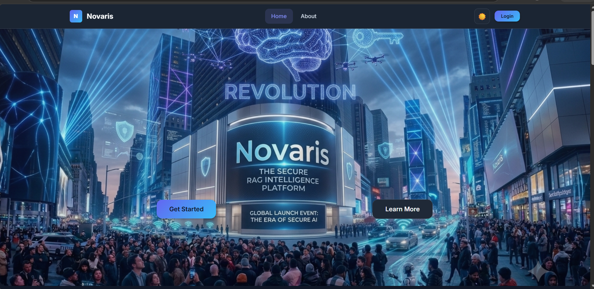

A modern landing page introducing Novaris, its core capabilities, platform features, interactive demo guide, and public dataset for visitors to explore without authentication.

---

### ⚡ Platform Features

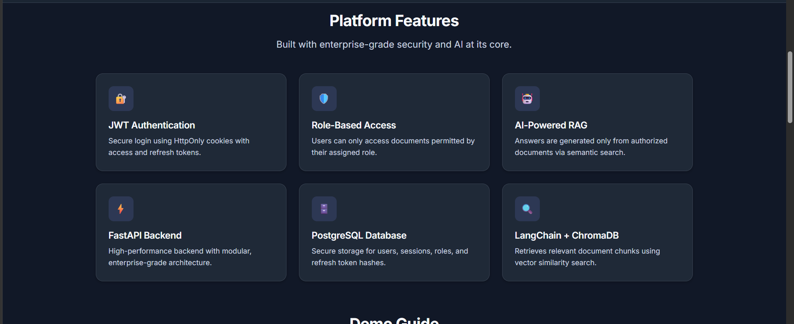

Highlights the technologies powering Novaris, including JWT Authentication, Role-Based Access Control (RBAC), FastAPI, PostgreSQL, LangChain, and ChromaDB.

---

### 🎯 Demo Guide

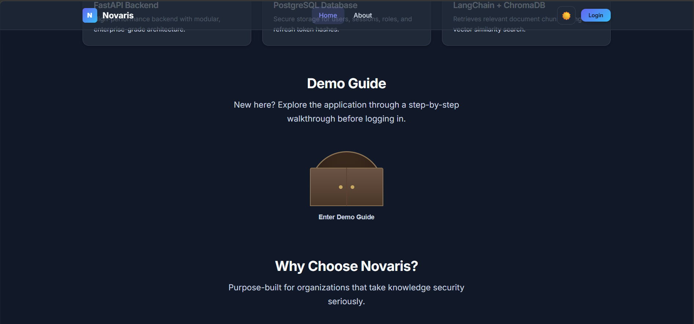

Interactive walkthrough that helps first-time users understand the application's workflow before logging in.

---

### 💡 Interactive Knowledge Cards

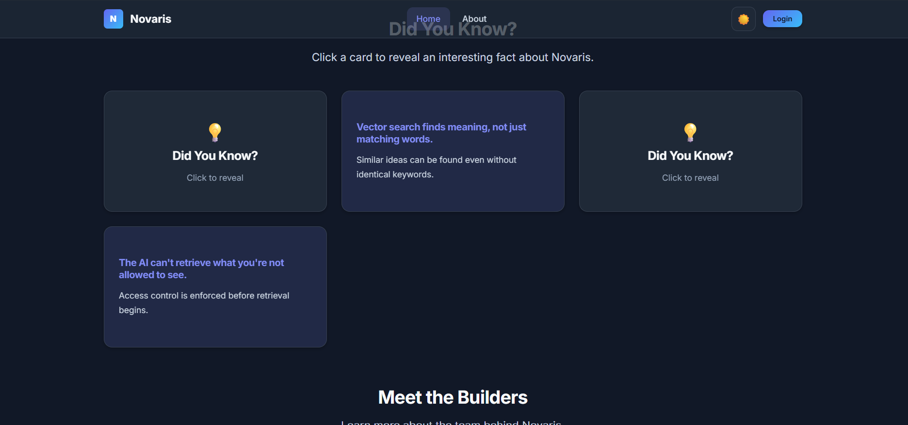

Clickable cards showcasing interesting facts about the platform while demonstrating interactive frontend components.

---

### 👨‍💻 Meet the Builders

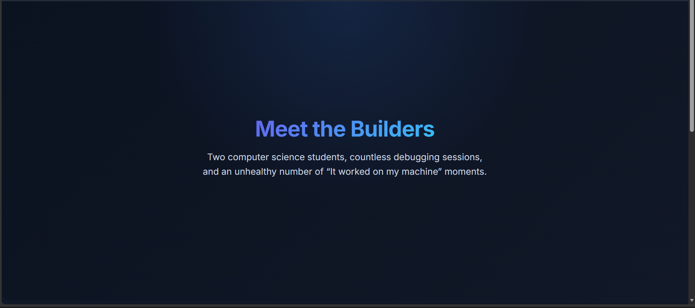

Introduces the developers behind Novaris with a polished team section and project credits.

---

### 🔐 Secure Login

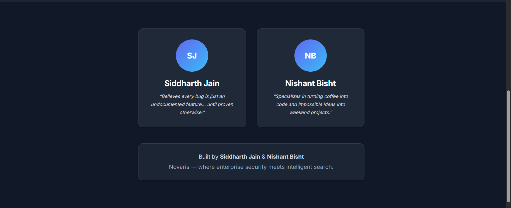

JWT-based authentication using HttpOnly cookies with secure session management and refresh token support.

---

### 📊 Dashboard

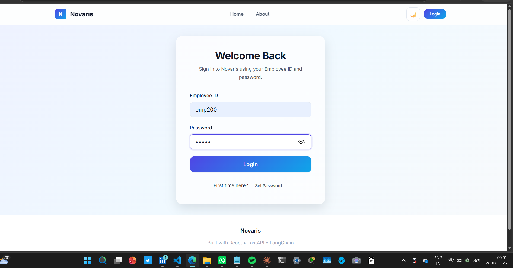

Displays authenticated user information, assigned role, and quick access to AI chat, dataset viewer, and password management.

---

### 📚 Public Dataset Viewer

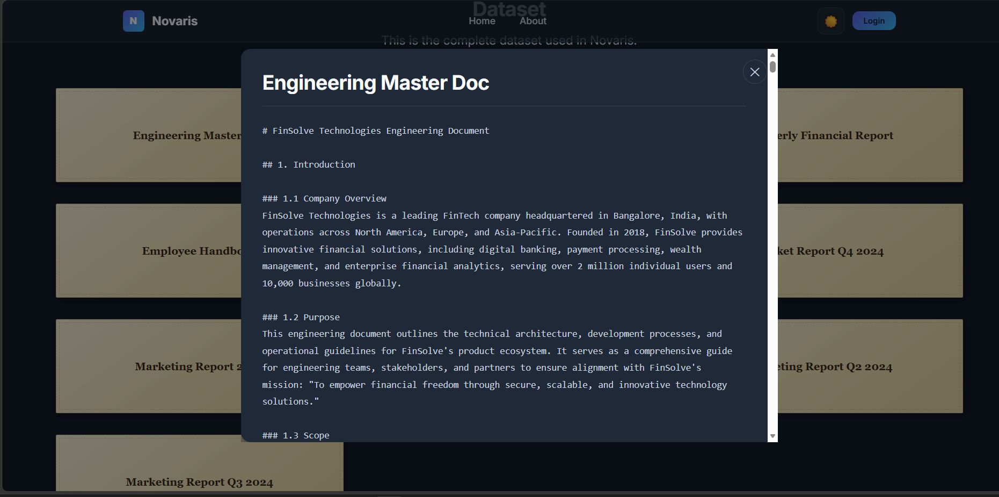

Browse the complete company dataset without authentication and open individual documents through an interactive document viewer.

---

### 📜 Example Questions

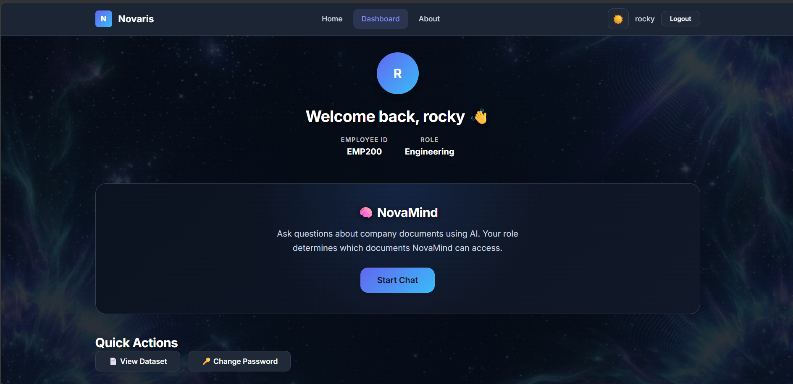

Built-in example prompts help users quickly explore the knowledge base without needing to invent their own queries.

---

### 🤖 AI Chat (RAG)

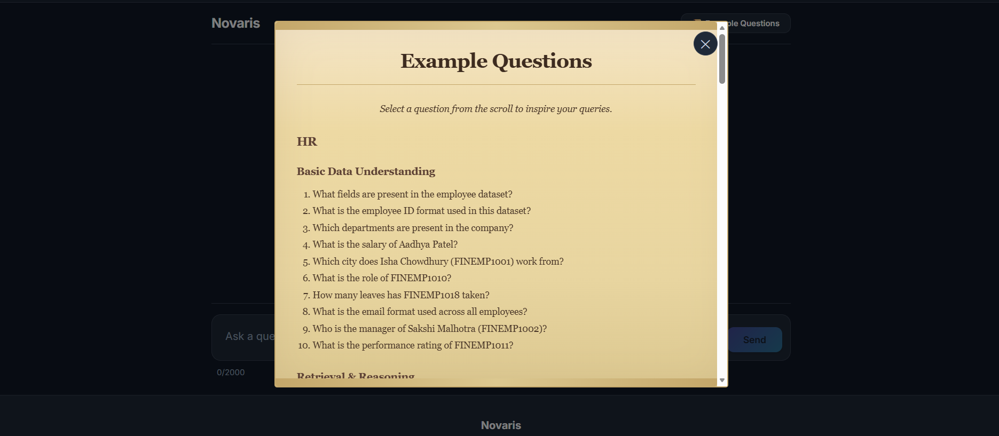

Enterprise Retrieval-Augmented Generation (RAG) interface that answers questions exclusively from authorized company documents while enforcing Role-Based Access Control.

---

### 📄 Document Viewer

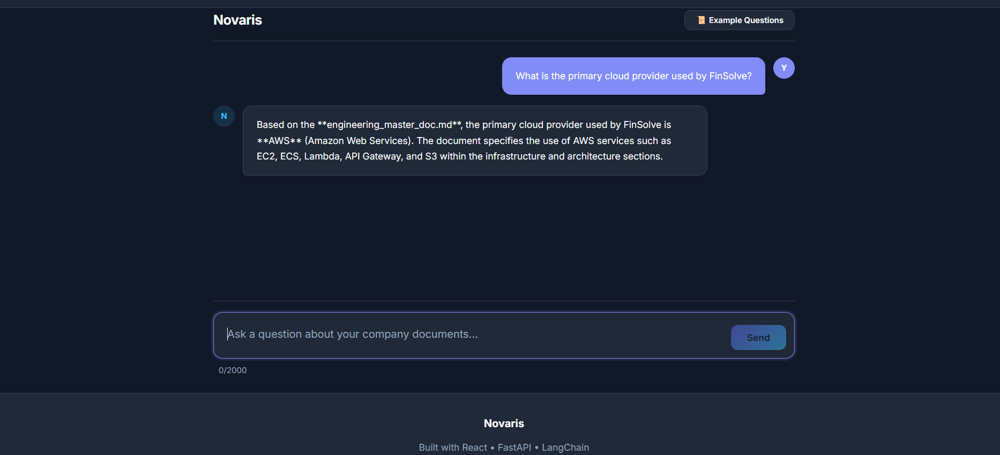

Interactive modal for reading complete document contents directly within the application without leaving the dataset browser.

---

### 👨‍💼 Admin Panel


Administrator-only interface for creating employee accounts with role validation and secure user management.


## Project Structure

```
Role-Based-AI-Assistant/

├── backend/
│   ├── auth/
│   ├── rag_engine/
│   ├── main.py
│   └── shared_cons.py
│
├── frontend/
│   ├── src/
│   ├── public/
│   └── dist/
│
├── data/
│
├── docs/
│
├── Dockerfile
├── .dockerignore
├── requirements.txt
└── README.md
```

A detailed explanation of the project structure is available in:

```
docs/FOLDER_STRUCTURE.md
```

---

## Running the Project Locally

### Clone the repository

```bash
git clone https://github.com/<your-username>/Role-Based-AI-Assistant.git

cd Role-Based-AI-Assistant
```

---

### Backend Setup

Create a virtual environment

```bash
python -m venv venv
```

Activate it

Windows

```bash
venv\Scripts\activate
```

Linux / macOS

```bash
source venv/bin/activate
```

Install dependencies

```bash
pip install -r requirements.txt
```

Configure your backend environment variables.

Example:

```env
DATABASE_URL=...
SECRET_KEY=...
GROQ_API_KEY=...
CLIENT_URL=http://localhost:5173
```

Run the backend

```bash
uvicorn backend.main:app --reload
```

---

### Frontend Setup

Navigate to the frontend

```bash
cd frontend
```

Install dependencies

```bash
npm install
```

Create your frontend environment file.

Example:

```env
VITE_API_URL=http://localhost:8000
```

Run the frontend

```bash
npm run dev
```

The application will now be available locally.

---

## Deployment

Novaris is deployed using a cloud-native architecture.

### Backend

- AWS EC2
- Docker
- Ubuntu 24.04

### Frontend

- Production build generated using Vite
- Served by Caddy

### Database

- Supabase PostgreSQL

### Security

- HTTPS
- Let's Encrypt SSL certificates
- HttpOnly cookies
- Secure environment variables

For the complete deployment process, including Docker, EC2, Caddy, DuckDNS, and HTTPS configuration, see:

```
docs/DEPLOYMENT.md
```

---

## Documentation

Comprehensive documentation is available inside the **docs/** directory.

| Document | Description |
|----------|-------------|
| PROJECT_CONTEXT.md | High-level overview of the project |
| SYSTEM_ARCHITECTURE.md | Complete system architecture |
| AUTH_FLOW.md | Authentication and session management |
| API_REFERENCE.md | Backend API documentation |
| DEPLOYMENT.md | Deployment guide |
| FOLDER_STRUCTURE.md | Repository organization |
| FRONTEND_STATUS.md | Frontend implementation details |
| MANUAL_TESTING.md | End-to-end testing report |
| FUTURE_WORK.md | Planned improvements for future versions |

---

## Future Roadmap

Version 1 focuses on delivering a complete, production-ready enterprise AI assistant.

Planned improvements for Version 2 include:

- Redis integration
- API rate limiting
- Docker Compose
- CI/CD using GitHub Actions
- Improved monitoring and logging
- Streaming AI responses
- Performance optimizations
- Enhanced administration features

A detailed roadmap is available in:

```
docs/FUTURE_WORK.md
```

---

## Design Principles

-Security-first authentication
-Separation of authentication and authorization
-Modular architecture
-Centralized API communication
-Least-privilege RBAC
-Maintainability and scalability

---

## Current Status

Current Version

```
v1.0
```

Status

```
Production Ready
```

Completed

- Secure authentication system
- Role-based authorization
- Enterprise RAG pipeline
- React frontend
- FastAPI backend
- Cloud deployment
- HTTPS configuration
- End-to-end manual testing
- Project documentation

Future work will focus on scalability, performance, and production enhancements while preserving the current architecture.

---

## Contributing

This repository currently serves as a personal portfolio and learning project.

Suggestions, bug reports, and constructive feedback are always welcome.

---

## Author

**Siddharth Jain**
**Nishant Bisht**

Computer Science Engineering Students

Graphic Era Deemed to be University

GitHub:

```
https://github.com/siddhistan
```

LinkedIn:

```
https://www.linkedin.com/in/siddharth-jain-494066382 
```

---

## Acknowledgements

This project was built using several outstanding open-source technologies.

Special thanks to the communities behind:

- FastAPI
- React
- Vite
- Docker
- PostgreSQL
- Supabase
- ChromaDB
- HuggingFace
- LangChain
- Groq
- Caddy
- AWS

Their tools and documentation made this project possible.

---

If you found this project interesting, consider giving it a ⭐ on GitHub.